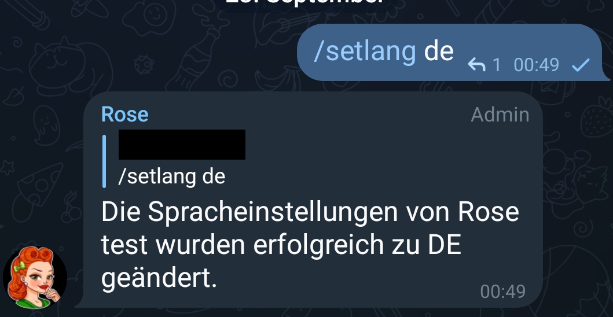

== Konfiguration

Folgende Kommandos werden für die Konfiguration der Gruppe bzw. des Moderators verwendet. Idealerweise solltest du für jedes dieser Kommandos deine persönliche Entscheidung bez. des zu konfigurierenden Verhaltens getroffen haben, bevor du Rose auf die Welt loslässt. Wir nutzen die Einteilung durch das `help` Kommando als roten Faden.

image::images/admin-help.png[Admin]

== Admin

Das Befördern & Degradieren von Admins zähle ich als Steuerkommando. Für die Konfiguration sind nur wenige Kommandos interessant. 

=== anonadmin

Erlaubt es Administratoren, die anonym als "die Gruppe" (ohne ihren eigenen Namen) zu chatten, Rose Befehle zu geben oder halt nicht.

Mögliche Werte: `on` `off`

Beispiel:

=== adminerror

== Spracheinstellungen (Languages)

=== /setlang

Stellt die Sprache der durch Rose verwendeten Texte um. Sprachen werden anhand von Codes identifiziert. Für Deutsch nimmt man z.B. `de`. Die wichtigsten sind Sprachen sind

|===
|Sprache | Code
|de	|Deutsch
| en | English
|en-gb	|British English
|nl |	Nederlands
|===

Beispiel: Umstellen der Sprache auf Deutsch

== /antiraid

== /raidmode
== /raidtime
== /raidactiontime
== /autoantiraid
== /setautoantiraid
== /lock
== /unlock
== /allowlist
== /rmallowlist
== /lockwarns
== /locks
== /addblocklist
== /unblocklist
== /unblocklistall
== /blocklist
== /blocklistmode
== /blocklistdelete
== /setblocklistreason
== /resetblocklistreason
== /quietfed
== /joinfed
== /leavefed
== /chatfed
== /setflood
== /setfloodmode
== /filter
== /stop
== /stopall
== /reports
== /antichannelpin
== /cleanlinked
== /cleanlinkedchannel
== /welcome
== /goodbye
== /setwelcome
== /resetwelcome
== /setgoodbye
== /resetgoodbye
== /cleanservice
== /cleanwelcome
== /captcha
== /captchatime
== /captchamode
== /captchakick
== /captchakicktime
== /setcaptchatext
== /resetcaptchatext
== /captcharules
== /save
== /clear
== /clearall
== /privatenotes
== /admincache
== /legacyadmin
== /anonadmin
== /adminerror
== /resetallwarns
== /warnings
== /setwarnmode
== /warnmode
== /setwarnlimit
== /warnlimit
== /setwarntime
== /warntime
== /setrules
== /resetrules
== /clearrules
== /setrulesbutton
== /resetrulesbutton
== /privaterules
== /logchannel
== /log
== /nolog
== /disable
== /enable
== /disabled
== /disabledel
== /approve
== /unapprove
== /unapproveall
== /approved
== /export
== /import
== /silentactions

== /setrules

Mit `/setrules &lt;message&gt;` kannst du die Nachricht festlegen, die Nutzer sehen, wenn sie durch das `/rules` Kommando die Regeln deiner Gruppe anfordern. 

