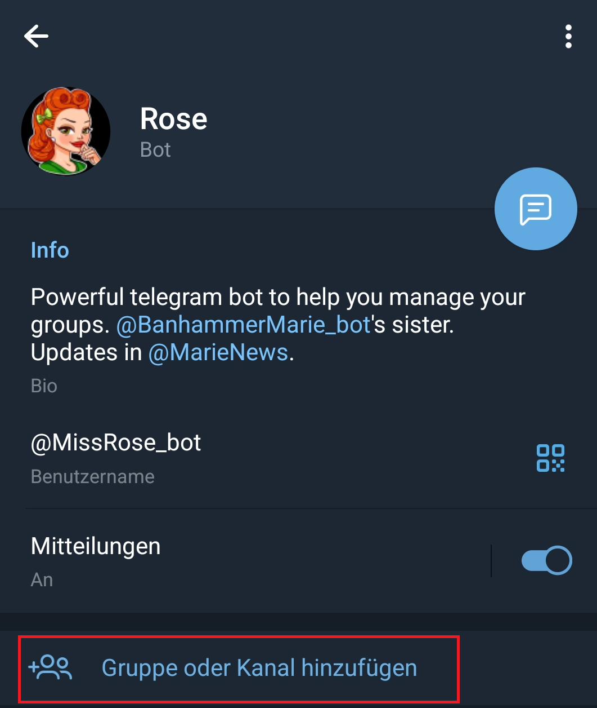
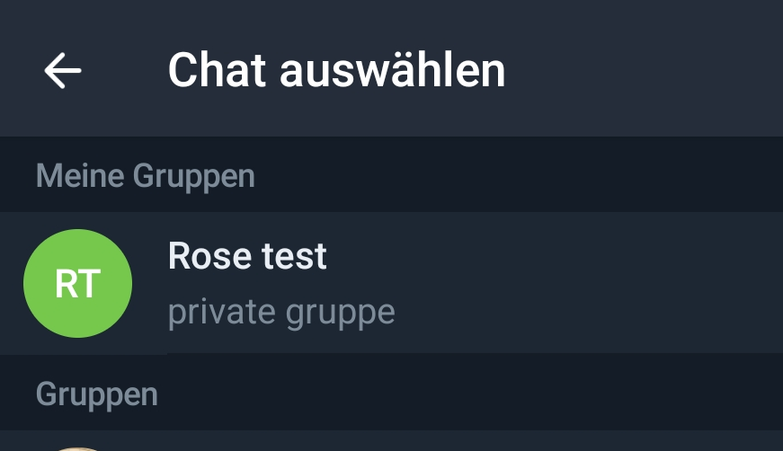
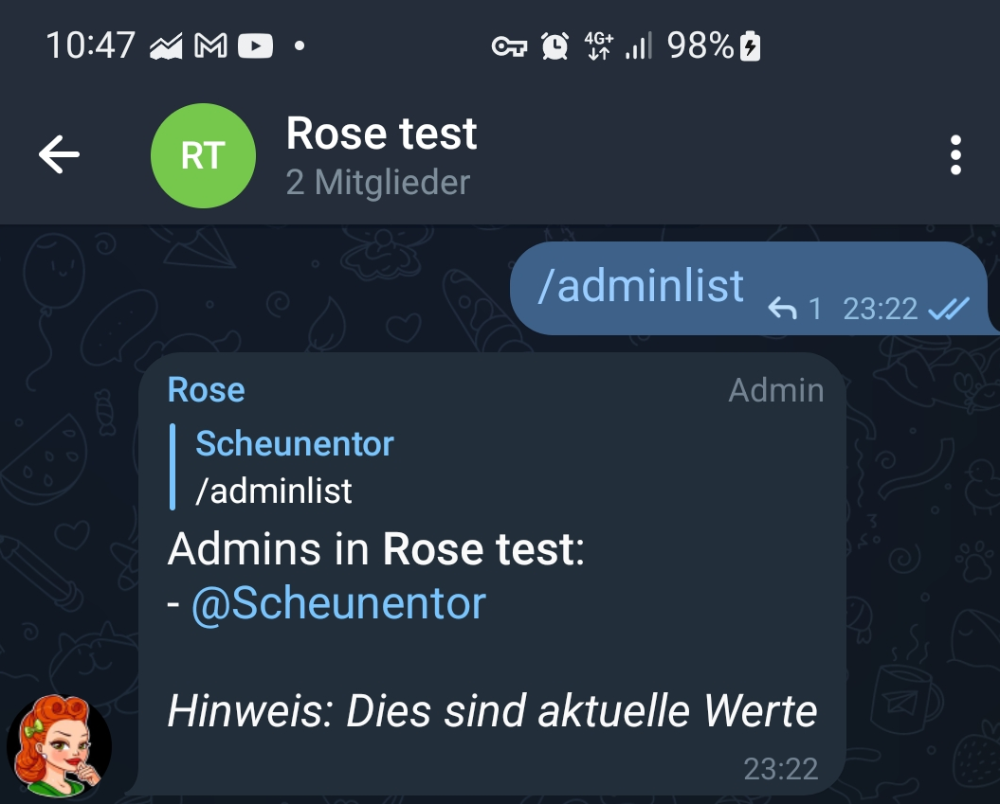
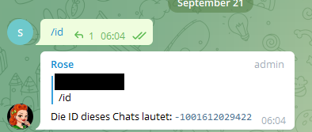
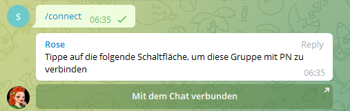
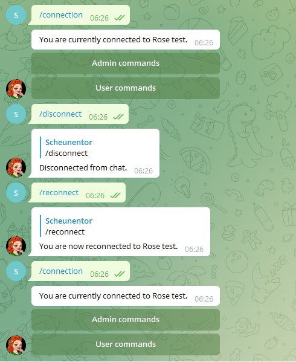

= Rose als Moderatorin

Rose muss immer zunächst einer Gruppe hinzugefügt werden (üblicherweise mit admin Rechten), damit man den Bot für besagte Gruppe konfigurieren kann.

== Rose per Link hinzufügen

Sollte man auf dem Handy oder mit Telegram Desktop unterwegs sein, kann man einfach http://telegram.me/MissRose_bot?startgroup=botstart[diesen Link] benutzen, um Rose zu einer Gruppe hinzu zuzufügen.

== Rose per Telegram UI hinzufügen

Man kann Rose auch über die Telegram Oberfläche zu Gruppen hinzufügen. Der Username ist https://t.me/MissRose_bot[@MissRose_bot]. Im Profil des Bots kann über "Gruppe oder Kanal hinzufügen" die Gruppen, in denen Rose für einen aktiv ist, verwalten.

.Das Nutzerprofil von Rose in der Telegram UI


.Gruppenverwaltung über die Telegram UI


== Rose konfigurieren / steuern

Gesteuert wird Rose über Chatbefehle (alle Textnachrichten, die mit `/` anfangen, zählen i.d.R. als Kommando / Befehl). Um diese Textnachrichten zu Rose zu bekommen, hat man mehrere Optionen.

=== Befehle im Gruppenchat selbst

Rose liest offensichtlich den gesamten Chat einer Gruppe mit. Daher kann man Befehle ganz entspannt in den Gruppenchat schreiben und der Bot wird reagieren.

.Ausführung eines Befehls im Gruppenchat


=== Befehle über privaten Chat

Wenn man nicht will, dass jeder die Befehle sehen kann, die man Rose gibt, gibt es noch eine etwas elegantere Möglichkeit der Steuerung:

Du kannst über einen 1:1 privaten Chat zwischen Rose und dir beliebig viele Gruppen verwalten. Das offensichtliche Problem hierbei ist natürlich, wie du Rose mitteilst, welche Gruppe du gerade administrieren willst. Dafür brauchst du die Gruppen-ID.

=== Gruppen-ID herausfinden

Tippe `/id` in den Gruppenchat, für den du Rose konfigurieren willst. Rose muss dafür schon in der Gruppe sein! Gruppen haben immer negative Zahlen als IDs. Solltest du eine positive Zahl bekommen, ist das eine User-ID und du bist irgendwo falsch abgebogen.

.Ermitteln der Gruppen-ID


Als Beispiel nehmen wir ID -1001612029422 und ziehen das Ganze exemplarisch durch.

== Rose mit einer Gruppe connecten

Mit der Gruppen-ID kannst du Rose mitteilen, dass du ab diesem Zeitpunkt mit allen deinen Befehlen eine bestimmte Gruppe meinst. Das gilt bis du dir es anders überlegst (s.u.). Der Bot nennt das "sich mit der Gruppe connecten".

Das zugehörige Kommando ist `/connect &lt;Gruppen-ID&gt;`. In unserem Beispiel also `/connect -1001612029422`

Sobald sich Rose erfolgreich mit einer Gruppe verbunden hat, *wird dein privater Chat mit Rose quasi deine Administrator-Oberfläche*.

Du kannst auch in einem Gruppenchat den `/connect` Befehl ausführen. Die Gruppen-ID holt sich Rose dann aus der Gruppe, in der sie den Befehl findet und du musst sie nicht extra mit angeben. Solange Rose in der Gruppe ist, kannst du also zu jedem Zeitpunkt mit `/connect` im Gruppenchat wieder zu deiner Admin-Oberfläche (euren 1:1 Chat) für die jeweilige Gruppe springen.

.Connection mit einer Gruppe durch Nutzung des Gruppenchats


Wenn du die Verbindung zu einer der Gruppe loswerden willst, machst du das mit `/disconnect`, um sie wiederzuholen benutzt du `/reconnect`. Infos über den momentanen Zustand von Rose gibt es mit `/connection`.

.Lebenszyklus der Connection mit einer Gruppe


== Kommandos

Da wir nun eine willige und auf die richtige Gruppe zeigende Rose haben, wird es Zeit sich die eigentlichen Kommandos näher anzusehen.

Verfügbare Kommandos werden aufteilt in Befehle für den Pöbel (User in deiner Gruppe) und Befehle für die Obrigkeit (Admins in deiner Gruppe). Das wird für dich im Chat mit Rose auch entsprechend visualisiert:

.2 Klassen Gesellschaft bei Kommandos


Auf Knopfdruck werden wir mit einer ansehnlichen Menge Kommandos beworfen.

=== Kommandos für User

Für User verfügbare Kommandos betreffen üblicherweise Informationen über Gruppe, Regeln oder andere informative Funktionen.

[%autowidth.stretch]
|===
|Kommando | Beschreibung  | Beispiel

| `/flood` | Zeigt die momentan geltenden Einschränkungen für zu geschwätzige Gruppenmitglieder a| image::images/commands.png[]
| `/filters` | Zeige alle aktiven Filter an a| 
| `/get` | a| image::images/adminlist.png[]
| `/saved` | a| image::images/adminlist.png[]
| `/adminlist` | Zeigt die Administratoren der Gruppe an a| image::images/adminlist.png[]
| `/info <user>` | Zeigt Informationen für einen Benutzer an. Wird kein User angegeben, fragt man wie immer für sich selbst. a| image::images/adminlist.png[]
| `/warns <user>` | Zeigt die Warnungen für einen Benutzer an. Wird kein User angegeben, fragt man wie immer für sich selbst. a| image::images/adminlist.png[]
| `/rules` | Zeigt einen Knopf für die konfigurierten Chat Regeln an a| image::images/adminlist.png[]
| `/approval` | a| image::images/adminlist.png[]
|===


== Kommandos für Administratoren

Die Kommandos für Administratoren steuern die invasiven Operationen des Bots, die grobe Änderungen an der Gruppe bzw. Eingriffe in die Gruppe auslösen können. Hier kommt der Moderator-Gedanke ins Spiel, denn Rose kann eine ganze Menge Housekeeping Funktionalitäten einer Gruppe für dich übernehmen.

[source,shell]
----
Admin commands available:
- /setlang
- /antiraid
- /raidmode
- /raidtime
- /raidactiontime
- /autoantiraid
- /setautoantiraid
- /lock
- /unlock
- /allowlist
- /rmallowlist
- /lockwarns
- /locks
- /addblocklist
- /unblocklist
- /unblocklistall
- /blocklist
- /blocklistmode
- /blocklistdelete
- /setblocklistreason
- /resetblocklistreason
- /quietfed
- /joinfed
- /leavefed
- /chatfed
- /setflood
- /setfloodmode
- /filter
- /stop
- /stopall
- /reports
- /antichannelpin
- /cleanlinked
- /cleanlinkedchannel
- /welcome
- /goodbye
- /setwelcome
- /resetwelcome
- /setgoodbye
- /resetgoodbye
- /cleanservice
- /cleanwelcome
- /captcha
- /captchatime
- /captchamode
- /captchakick
- /captchakicktime
- /setcaptchatext
- /resetcaptchatext
- /captcharules
- /save
- /clear
- /clearall
- /privatenotes
- /admincache
- /legacyadmin
- /anonadmin
- /adminerror
- /resetallwarns
- /warnings
- /setwarnmode
- /warnmode
- /setwarnlimit
- /warnlimit
- /setwarntime
- /warntime
- /setrules
- /resetrules
- /clearrules
- /setrulesbutton
- /resetrulesbutton
- /privaterules
- /logchannel
- /log
- /nolog
- /disable
- /enable
- /disabled
- /disabledel
- /approve
- /unapprove
- /unapproveall
- /approved
- /export
- /import
- /silentactions

----

Die Hilfefunktion, die du jederzeit mit `/help` aufrufen kannst, gibt einen nach Themen gruppierten Überblick, an dem wir uns entlang hangeln werden. Eine wichtige Unterscheidung wird dort allerdings vergessen. Auch wenn per se alles als Kommando bezeichnet wird, gibt es prinzipiell 2 Arten von Interaktion mit einem Bot:

. Das Konfigurieren von Eigenschaften, auf deren Basis der Bot danach eigenständig agiert. Man könnte auch sagen der Status des Bots ändert sich. Ein Beispiel ist das Festlegen des Begrüßungstexts oder der Sprache. Diesen Teil der Kommandos muss ich vor der Nutzung des Bots festlegen, damit die Gruppe optimal verwaltet werden kann.

. Direkte Befehle, denen der Bot gehorcht. Es werden zwar Aktionen ausgelöst, diese ändern den Status des Bots aber nicht. Ein Beispiel wäre das Muten oder Kicken eines Users in der Gruppe. Diesen Teil der Kommandos wenden Admins aktiv im Tagesgeschäft der Gruppe an. Sie können sehr wohl den Status der Gruppe ändern, aber nicht den Status des Bots bzw. dessen Konfiguration.

= Konfiguration

Folgende Kommandos werden für die Konfiguration der Gruppe bzw. des Moderators verwendet. Idealerweise solltest du für jedes dieser Kommandos deine persönliche Entscheidung bez. des zu konfigurierenden Verhaltens getroffen haben, bevor du Rose auf die Welt loslässt. 

== /setrules

Mit `/setrules &lt;message&gt;` kannst du die Nachricht festlegen, die Nutzer sehen, wenn sie durch das `/rules` Kommando die Regeln deiner Gruppe anfordern. Es werden https://core.telegram.org/api/entities[Markdown] und Knöpfe unterstützt.

Im Klartext heißt das, du kannst die folgenden Styleelemente verwenden:

* *Fetter text*
[source,markdown]
----
<b>Fetter text</b> 
<strong>Fetter text</strong>
**Fetter text**
----

* 

_Kursiver Text_

[source,markdown]
----
<i>Kursiver Text</i> 
<em>Kursiver Text</em>
*Kursiver Text*
----

* 

[line-through]#Durchgestrichener Text#

[source,markdown]
----
<s>strike</s>
<del>strike</del>
~~strike~~
----

* 

`Codeblock`

[source,markdown]
----
<code>Codeblock</code>
`Codeblock`
----

<i>kursiv</i>, <em>kursiv</em> _kursiv_

----

wird zu 

<b>bold</b>, <strong>bold</strong>, **bold**

# Administration

<figure>

<figcaption align = "center"><b>Hilfefunktion mit /help</b></figcaption>
</figure>

## Administrator Management

### /promote

Mit `/promote` kannst du gezielt User zu Administratoren befördern. Hierfür hast du wie immer 2 Optionen:

1. Beförderung über Namen bzw. ID

`/promote `

### Adminstratoren ernennen

| Kommando                       | Für Admins verfügbar | Für user verfügbar | Beispiel |
|--------------------------------|--------------------|-------------------|----------|
| `/promote <@username oder ID>` |                      |                    |          |
|                                |                    |                   |          |

## Antiflood

## AntiRaid

## Approval

## Bans

#### Blocklists

#### CAPTCHA

#### Connections

#### Disabling

#### Federations

#### Filters

#### Formatting

#### Greetings

#### Import/Export

#### Languages

Stellt die Sprache der durch Rose verwendeten Texte um. Für uns relevant ist deutsch:

----

----

#### Locks

#### Log Channels

#### Misc

#### Notes

#### Pin

#### Privacy

#### Purges

#### Reports

#### Rules

#### Warnings

### User Kommandos

## Sprache ändern

`/setlang de` stellt auf deutsche Sprache. `/setlang en` stellt wieder auf englisch.

## Interaktion mit Usern

### User-ID herausfinden

Auch wenn wir Namen sehen kennt Telegram eigentlich nur IDs für User. Wenn du die ID eines Users herausfinden willst schreib einfach `/id <@username>` in den Chat. Rose erledigt den Rest & lässt es dich wissen, außer der Nutzer wurde vom Bot noch nie gesehen

<figure>

<figcaption align = "center"><b>Erfragen einer User-ID für einen gegebenen Namen</b></figcaption>
</figure>

**User haben immer positive IDs.**

### Kick (rauswerfen)

**Ein gekickter User kann immer wiederkommen!**

Um einen User zu kicken gibt es 2 Möglichkeiten:

----

/kick &lt;@username or UserID&gt;
```

=== Mute (stumm schalten)

=== Ban (verbannen)