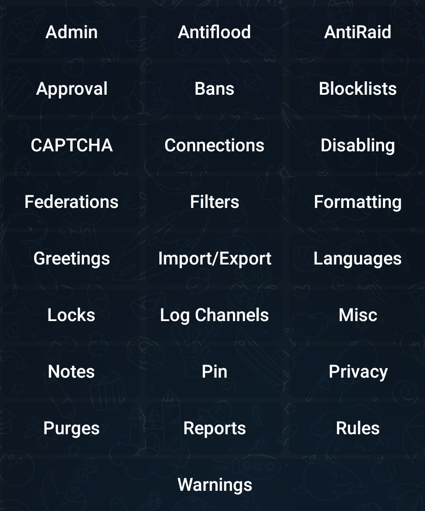
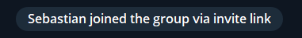
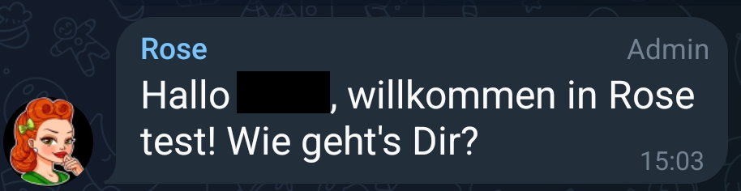

= Rose Bot als Moderator

Rose muss immer zunächst einer Gruppe hinzugefügt werden (üblicherweise mit admin Rechten), damit man den Bot für besagte Gruppe konfigurieren kann. Wie man das tut, ist link:Installation.adoc[hier] erklärt.

Nachdem Rose in deiner Gruppe angekommen ist, kannst bzw. musst du ihr Befehle geben, damit sie weiß, was sie tun bzw. wie sie sich verhalten soll. Wie du dich mit Rose verständigen kannst, ist link:Kommunikation.adoc[hier] erklärt.

Da du nun eine willige und auf die richtige Gruppe zeigende Rose hast, wird es Zeit sich die eigentlichen Kommandos näher anzusehen. Eine kurze Einleitung zu Kommandos und wem welche Kommandos zur Verfügung stehen, findest du link:Kommandos.adoc[hier]. 

Die Hilfefunktion, die du jederzeit mit `/help` aufrufen kannst, gibt einen nach Themen gruppierten Überblick.

[.center.text-center]

Eine wichtige Unterscheidung wird dort allerdings vergessen. Auch wenn alles als "Kommando" bezeichnet wird, gibt es prinzipiell 2 Arten von Interaktion mit dem Bot:

. Das Konfigurieren von Eigenschaften, auf deren Basis der Bot danach eigenständig agiert. Man könnte auch sagen der Status des Bots ändert sich. Ein Beispiel ist das Festlegen des Begrüßungstexts oder der Sprache. Diesen Teil der Kommandos muss ich vor der Nutzung des Bots festlegen, damit die Gruppe optimal verwaltet werden kann. Die konfigurativen Kommandos sind link:Konfiguration.adoc[hier] beschrieben.

. Direkte Befehle, denen der Bot gehorcht. Es werden zwar Aktionen ausgelöst, diese ändern den Status des Bots aber nicht. Ein Beispiel wäre das Muten oder Kicken eines Users in der Gruppe. Diesen Teil der Kommandos wenden Admins aktiv im Tagesgeschäft der Gruppe an. Sie können sehr wohl den Status der Gruppe ändern, aber nicht den Status des Bots bzw. dessen Konfiguration. Die steuernden Kommandos sind link:Steuerung.adoc[hier] beschrieben.

Da du nun Experte bist, fehlt nur noch die Anforderungen für deine Gruppe festlegen. Ich denke das machen wir am besten anhand einer Reihe von Fragen. Falls nicht anders angegeben, kannst du Buttons und link:Markdown.adoc[diese Style-Elemente] in allen Texten verwenden.

* Was sollen Mitglieder in der Gruppe können? Im Zweifel fangen wir mit *nichts* an und arbeiten uns vor ;-)

* Welche Regeln möchtest du den Mitgliedern präsentieren (wenn überhaupt)? (Siehe link:Markdown.adoc[Style-Elemente])

* Möchtest du, das im Chat festgehalten wird, wenn Mitglieder dazukommen oder verschwinden?

[.center.text-center]

* Möchtest du, dass neue Mitglieder in der Gruppe begrüßt werden? Falls ja, mit welchem Text? (Siehe link:Markdown.adoc[Style-Elemente]) 

[.center.text-center]

* Sollen diese Begrüßungen aufgeräumt werden (nach 5 Minuten), um den Chat sauber zu halten? 

* Möchtest du, dass neue Mitglieder in der Gruppe 

** zunächst eine Zeit lang stumm geschaltet sind? (Soll als Spam Schutz dienen)
** einen Button drücken müssen, um entmuted zu werden? (Soll als Mensch-Erkennung dienen)
** Den Regeln zustimmen müssen, bevor sie reden dürfen?

* Wie viele Warnungen soll ein Nutzer haben könne, bis etwas passiert?

* Was soll bei maximalen Warnungen passieren? (KICK, BAN)?

