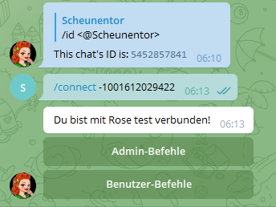
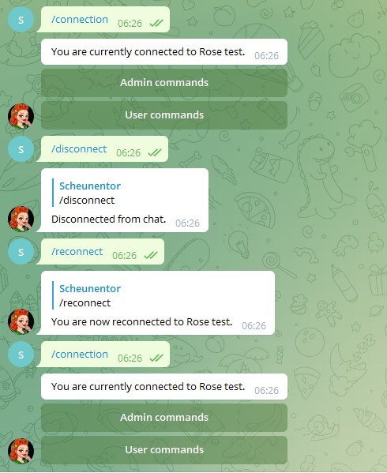

# Rose Moderator

Man kann Rose einfach in die Gruppe einladen wie einen normalen Nutzer. Der Username ist `https://t.me/MissRose_bot`.

Gesteuert wird der Bot dann über Chatbefehle (alles, was mit `/` anfängt zählt i.d.R. als Kommando / Befehl). Diese Befhele kann man einfach in den Gruppenchat schreiben. Es gibt aber auch eine etwas elegantere Methode, damit keiner sieht, was du mit dem Bot machst. Hierfür benötigen wir die Gruppen-ID der Zielgruppe.

## Gruppen-ID herausfinden

Tippe `/id` in den Gruppenchat, für den du Rose konfigurieren willst. Rose muss dafür schon in der Gruppe sein! Gruppen haben immer negative Zahlen als IDs. Solltest du eine positive Zahl bekommen ist das eine User-ID und damit falsch.

```
Scheunentor, [21.09.2022 06:04]
/id

Rose, [21.09.2022 06:04]
[In reply to Scheunentor]
Die ID dieses Chats lautet: -1001612029422

```

Als Beispiel nehmen wir ID -1001612029422 und ziehen das Ganze exemplarisch durch.

## Rose mit Gruppe verbinden

Mit der Gruppen-ID können wir Rose anchatten und anweisen sich mit unserer Gruppe zu "verbinden". **Ab diesem Moment ist dein privater Chat mit Rose quasi deine Administrator-Oberfläche!**




## Private Chat mit Rose statt Gruppenchat

Solange Rose in der Gruppe ist, kannst du zu jedem Zeitpunkt mit `/connect` deinen Chat mit ihr wieder aufmachen. Hier wirst du die meisten Befehle absetzen.

Wenn du die Verbindung zur der Gruppe loswerden willst, machst du das mit `/disconnect`, um sie wieder zu holen `/reconnect`. Infos über den momentanen Zustand von Rose gibt es mit `/connection`.




## Sprache ändern

`/setlang de` stellt auf deutsche Sprache. `/setlang en` stellt wieder auf englisch.

## Interaktion mit Usern

### User-ID herausfinden

Auch wenn wir Namen sehen kennt Telegram eigentlich nur IDs für User. Wenn du die ID eines Users herausfinden willst schreib einfach `/id <@username>` in den Chat. Rose erledigt den Rest & lässt es dich wissen, außer der Nutzer wurde vom Bot noch nie gesehen

```
Scheunentor, [21.09.2022 06:10]
/id @Scheunentor

Rose, [21.09.2022 06:10]
[In reply to Scheunentor]
Die ID des Nutzers Scheunentor lautet 5452857841.
```

**User haben immer positive, 8 stellige IDs.**

### Kick (rauswerfen)

**Ein gekickter User kann immer wiederkommen!**

Um einen User zu kicken gibt es 2 Möglichkeiten:

```
/kick <@username or UserID>
```
### Mute (stumm schalten)
### Ban (verbannen)

