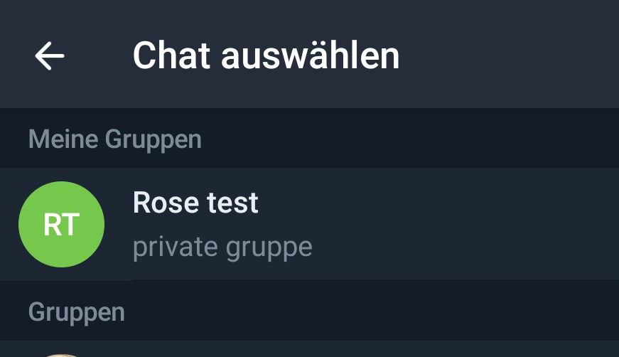
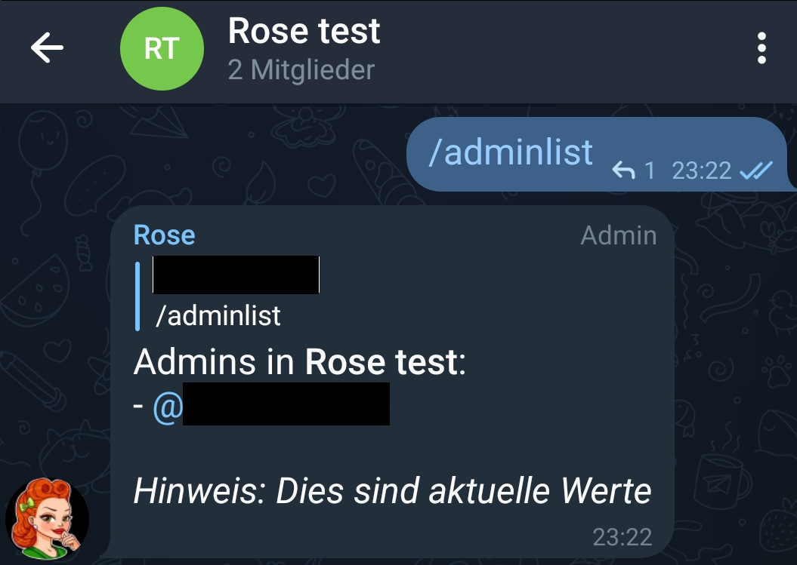
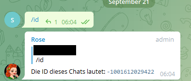
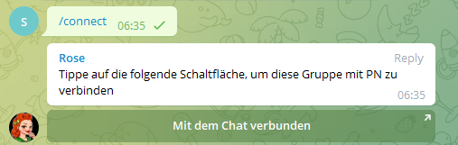

# Rose als Moderatorin

Rose muss immer zunächst einer Gruppe hinzugefügt werden (üblicherweise mit admin Rechten), damit man den Bot für besagte Gruppe konfigurieren kann.

## Rose per Link hinzufügen

Sollte man auf dem Handy oder mit Telegram Desktop unterwegs sein, kann man einfach [diesen Link](http://telegram.me/MissRose_bot?startgroup=botstart) benutzen, um Rose zu einer Gruppe hinzu zuzufügen.

## Rose per Telegram UI hinzufügen

<p>
Man kann Rose auch über die Telegram Oberfläche zu Gruppen hinzufügen. Der Username ist `https://t.me/MissRose_bot`. Im Profil des Bots kann über "Gruppe oder Kanal hinzufügen" die Gruppen in denen Rose für einen aktiv ist verwalten.
</p>

<figure>

<figcaption align = "center"><b>Das Nutzerprofil von Rose in der Telegram UI</b></figcaption>
</figure>

<figure>

<figcaption align = "center"><b>Gruppenverwaltung über die Telegram UI</b></figcaption>
</figure>

# Rose konfigurieren / steuern

<p>
Gesteuert wird Rose über Chatbefehle (alle Textnachrichten, die mit `/` anfangen, zählen i.d.R. als Kommando / Befehl). Um diese Textnachrichten zu Rose zu bekommen, hat man mehrere Optionen.
</p>

## Befehle im Gruppenchat selbst

<p>
Rose liest offensichtlich den gesamten Chat einer Gruppe mit. Daher kann man Befehle ganz entspannt in den Gruppenchat schreiben und der Bot wird reagieren. 
</p>


<figure>

<figcaption align = "center"><b>Ausführung eines Befehls im Gruppenchat</b></figcaption>
</figure>

## Befehle über privaten Chat

<p>
Wenn man nicht will, dass jeder die Befehle sehen kann, die man Rose gibt, gibt es noch eine etwas elegantere Möglichkeit der Steuerung:

Du kannst über einen 1:1 privaten Chat zwischen Rose und dir beliebig viele Gruppen verwalten. Das offensichtliche Problem hierbei ist natürlich, wie du Rose mitteilst, welche Gruppe du gerade administrieren willst. Dafür brauchst du die Gruppen-ID.   
</p>

### Gruppen-ID herausfinden
<p>
Tippe `/id` in den Gruppenchat, für den du Rose konfigurieren willst. Rose muss dafür schon in der Gruppe sein! Gruppen haben immer negative Zahlen als IDs. Solltest du eine positive Zahl bekommen, ist das eine User-ID und du bist irgendwo falsch abgebogen.
</p>


<figure>

<figcaption align = "center"><b>"Bindung" an eine Gruppe über die Gruppen-ID</b></figcaption>
</figure>

Als Beispiel nehmen wir ID -1001612029422 und ziehen das Ganze exemplarisch durch.

# Rose mit einer Gruppe connecten

Mit der Gruppen-ID kannst du Rose mitteilen, dass du ab diesem Zeitpunkt mit allen deinen Befehlen eine bestimmte Gruppe meinst. Das gilt bis du dir es anders überlegst (s.u.). Der Bot nennt das "sich mit der Gruppe connecten". 

Das zugehörige Kommando ist `/connect <Gruppen-ID>`. In unserem Beispiel also `/connect -1001612029422`

Sobald sich Rose erfolgreich mit einer Gruppe verbunden hat, **wird dein privater Chat mit Rose quasi deine Administrator-Oberfläche**.

Du kannst auch in einem Gruppenchat den `/connect` Befehl ausführen. Die Gruppen-ID holt sich Rose dann aus der Gruppe, in der sie den Befehl findet und du musst sie nicht extra mit angeben. Solange Rose in der Gruppe ist, kannst du also zu jedem Zeitpunkt mit `/connect` im Gruppenchat wieder zu deiner Admin-Oberfläche (euren 1:1 Chat) für die jeweilige Gruppe springen. 

<figure>

<figcaption align = "center"><b>Connection mit einer Gruppe durch Nutzung des Gruppenchats</b></figcaption>
</figure>

Wenn du die Verbindung zu einer der Gruppe loswerden willst, machst du das mit `/disconnect`, um sie wiederzuholen benutzt du `/reconnect`. Infos über den momentanen Zustand von Rose gibt es mit `/connection`.

<figure>

<figcaption align = "center"><b>Lebenszyklus der Connection mit einer Gruppe</b></figcaption>
</figure>

# Kommandos

Da wir nun eine willige und auf die richtige Gruppe zeigende Rose haben, wird es Zeit sich die eigentlichen Kommandos näher anzusehen. 

Verfügbare Kommandos werden aufteilt in Befehle für den Pöbel (User in deiner Gruppe) und Befehle für die Obrigkeit (Admins in deiner Gruppe). Das wird für dich im Chat mit Rose auch entsprechend visualisiert: 

<figure>

<figcaption align = "center"><b>2 Klassen Gesellschaft bei Kommandos</b></figcaption>
</figure>


Auf Knopfdruck werden wir mit einer ansehnlichen Menge Kommandos beworfen:

```shell
User commands available:
- /flood
- /filters
- /get
- /notes
- /saved
- /adminlist
- /info
- /warns
- /rules
- /approval
```

```shell
Admin commands available:
- /setlang
- /antiraid
- /raidmode
- /raidtime
- /raidactiontime
- /autoantiraid
- /setautoantiraid
- /lock
- /unlock
- /allowlist
- /rmallowlist
- /lockwarns
- /locks
- /addblocklist
- /unblocklist
- /unblocklistall
- /blocklist
- /blocklistmode
- /blocklistdelete
- /setblocklistreason
- /resetblocklistreason
- /quietfed
- /joinfed
- /leavefed
- /chatfed
- /setflood
- /setfloodmode
- /filter
- /stop
- /stopall
- /reports
- /antichannelpin
- /cleanlinked
- /cleanlinkedchannel
- /welcome
- /goodbye
- /setwelcome
- /resetwelcome
- /setgoodbye
- /resetgoodbye
- /cleanservice
- /cleanwelcome
- /captcha
- /captchatime
- /captchamode
- /captchakick
- /captchakicktime
- /setcaptchatext
- /resetcaptchatext
- /captcharules
- /save
- /clear
- /clearall
- /privatenotes
- /admincache
- /legacyadmin
- /anonadmin
- /adminerror
- /resetallwarns
- /warnings
- /setwarnmode
- /warnmode
- /setwarnlimit
- /warnlimit
- /setwarntime
- /warntime
- /setrules
- /resetrules
- /clearrules
- /setrulesbutton
- /resetrulesbutton
- /privaterules
- /logchannel
- /log
- /nolog
- /disable
- /enable
- /disabled
- /disabledel
- /approve
- /unapprove
- /unapproveall
- /approved
- /export
- /import
- /silentactions
```
## Administrator Kommandos

Die Kommandos für Administratoren steuern die invasiven Operationen des Bots, die grobe Änderungen an der Gruppe bzw. Eingriffe in die Gruppe auslösen können. Hier kommt der Moderator-Gedanke ins Spiel, denn Rose kann eine ganze Menge Housekeeping Funktionalitäten einer Gruppe für dich übernehmen. 

Die Hilfefunktion, die du jederzeit mit `/help` aufrufen kannst, gibt einen nach Themen gruppierten Überblick der Kommandos, an dem wir uns entlang hangeln werden.

<figure>

<figcaption align = "center"><b>Hilfefunktion mit /help</b></figcaption>
</figure>

### Admin


#### Antiflood
#### AntiRaid
#### Approval
#### Bans
#### Blocklists
#### CAPTCHA
#### Connections
#### Disabling
#### Federations
#### Filters
#### Formatting
#### Greetings
#### Import/Export
#### Languages
Stellt die Sprache der durch Rose verwendeten Texte um. Für uns relevant ist deutsch:

```

```
#### Locks
#### Log Channels
#### Misc
#### Notes
#### Pin
#### Privacy
#### Purges
#### Reports
#### Rules
#### Warnings


### User Kommandos

## Sprache ändern

`/setlang de` stellt auf deutsche Sprache. `/setlang en` stellt wieder auf englisch.

## Interaktion mit Usern

### User-ID herausfinden

Auch wenn wir Namen sehen kennt Telegram eigentlich nur IDs für User. Wenn du die ID eines Users herausfinden willst schreib einfach `/id <@username>` in den Chat. Rose erledigt den Rest & lässt es dich wissen, außer der Nutzer wurde vom Bot noch nie gesehen

<br>
*Erfragen einer User-ID für einen gegebenen Namen*

**User haben immer positive IDs.**

### Kick (rauswerfen)

**Ein gekickter User kann immer wiederkommen!**

Um einen User zu kicken gibt es 2 Möglichkeiten:

```
/kick <@username or UserID>
```
### Mute (stumm schalten)
### Ban (verbannen)

